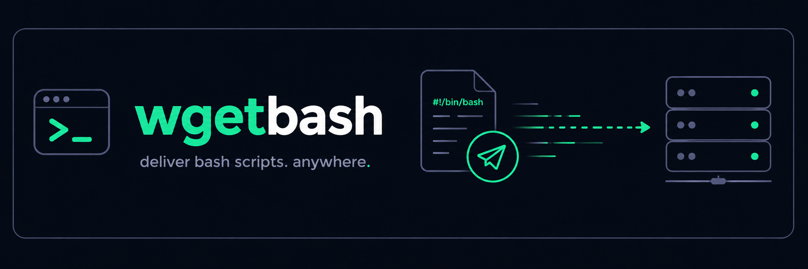

# wgetbash 🧩

Храните свои bash-скрипты в облаке и запускайте их на любом сервере одной командой.

## Зачем это нужно?

Не всегда есть смысл поднимать Ansible:

- **Инфраструктура простая.** Пара серверов — Ansible здесь будет перебором.
- **Сервер новый.** Нужно что-то сделать прямо сейчас, а автоматизация ещё не настроена.
- **Просто нужно хранить скрипты.** Все полезные команды собраны в одном месте и всегда под рукой.

## Как это работает

1. Создайте скрипт прямо в браузере. `#!/bin/bash` добавлять не нужно — он подставляется автоматически.
2. Нажимаете **wget** — готовая команда копируется в буфер обмена.
3. Вставьте ее на сервер и запустите. 

## Фичи и особенности

- Скрипт выполняется через пайп и не сохраняется на сервере — после выполнения ничего не нужно чистить.
- Есть встроенная обработка ошибок. При первой ошибке выполнение останавливается, выводится номер строки и красный `[ERROR]` с кодом выхода. Если всё прошло успешно — зелёный `[OK]`.
- Для офлайн инфраструктуры можно просто скопировать скрипт в буфер обмена и перенести его вручную.
- У каждого скрипта есть переключатель видимости. По умолчанию скрипт публичный, и кнопка предлагает **make private** (фиолетовая) — после нажатия ссылка отдаёт скрипт только владельцу с активной сессией в браузере. У приватного скрипта кнопка становится серой **make public** и возвращает всё обратно. Удобно, когда скрипт используется как заметка, а не как команда для сервера.

## Безопасность

Ссылка на скрипт вида `/<user-hash>/<script-hash>` формально публична, но без доступа к аккаунту подобрать или найти чужой скрипт практически невозможно.

Скрипт, помеченный **private**, по этой ссылке анонимно не отдаётся: без куки сессии владельца возвращается `401`, поэтому `wget ... | bash` на сервере для него работать не будет.

> Всё равно не храните здесь чувствительные данные.

# loger

Помощник для разбора логов. Чтобы в разгар инцидента не вспоминать команды, флаги и синтаксис.

Вся обработка выполняется в браузере — логи никуда не отправляются и остаются у вас.

- **Focus** — показать строку и N строк до и после неё.
- **Remove** — скрыть строки, совпадающие с шаблоном.
- **Grep** — оставить только строки, совпадающие с шаблоном.
- **Math** — фильтрация по числовому значению (например, показать строки, где число больше N).

Фильтры можно комбинировать. Результат применяется мгновенно, поэтому нужные записи удобно искать даже в больших логах.